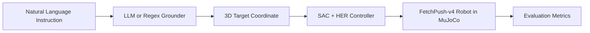

# Talk-to-Robot

*Where does LLM spatial grounding break when language instructions are mapped to robotic target coordinates?*


This repository contains our UC San Diego CSE 190 course project: **“Where Does LLM Spatial Grounding Break? An Instruction-Tier Study for Goal-Conditioned Robotic Manipulation.”**

## Project Overview



## Why This Matters

Humans naturally give spatial commands in language, not in `(x, y, z)` coordinates.  
Goal-conditioned robot controllers still require explicit target coordinates to act.  
This project isolates where errors come from by separating **language grounding** from **control**.

## Core Idea

We use a **decoupled architecture**:
- Grounder stage: map instruction -> target coordinate.
- Controller stage: map target coordinate -> robot behavior in `FetchPush-v4`.

In the main experiments, the controller is kept fixed, so end-to-end differences primarily reflect grounding quality rather than controller retraining effects.

## Instruction Tiers

| Tier | Instruction Type | Example | What It Tests |
| --- | --- | --- | --- |
| T0 | Literal coordinates | `push to (1.30, 0.85)` | Exact coordinate extraction/parsing |
| T1 | Named regions | `push to the upper-left corner` | Region-to-coordinate mapping |
| T2 | Relative offsets | `push it 5 cm to the right` | Direction, sign, and offset composition |
| T3 | Reference-object grounding | `push it next to the marker` | Relational grounding to context objects |
| T4 | Functional intent | `get it out of the way` | Ambiguous intent resolution |

## Methods

- **LLM grounder:** Gemini `gemini-3.1-flash-lite` via `src/talk_to_robot/grounding/grounder.py`.
- **Regex baseline:** deterministic parser for simpler tiers in `src/talk_to_robot/baselines/regex_grounder.py`.
- **SAC + HER controller:** goal-conditioned policy (Stable-Baselines3) for `FetchPush-v4`.
- **Environment:** `FetchPush-v4` in MuJoCo through `gymnasium-robotics`.
- **Evaluation harness:** unified grounding + rollout + scoring pipeline in `src/talk_to_robot/eval/harness.py`.

## Evaluation Metrics

- **Grounder Success Rate:** fraction of instructions where predicted goal is within tier tolerance of ground truth.
- **Policy Success Rate:** fraction of rollouts where the controller reaches the injected predicted goal.
- **End-to-End Success Rate:** fraction of rollouts that end within tolerance of the instruction ground-truth goal (strictly combines grounding and control effects).

## Key Results

| Tier | Representative End-to-End Result | Takeaway |
| --- | --- | --- |
| T0 | **98.3%** | Nearly solved; literal coordinate mapping is reliable. |
| T1 | **93.3%** | Also near solved; regex and LLM are comparable. |
| T2 | Best LLM around **76.7%**, regex **85.0%** | Major grounding cliff from offset/sign/workspace errors. |
| T3 | LLM around **71.7-78.3%** | Reference object identified, but with a consistent ~6 cm relational offset. |
| T4 | Around **45-55%** | Functional intent is under-specified; near chance-like behavior. |

> **Interpretation:** The kind of error matters more than average error.

<details>
<summary>Show run-specific snapshots from <code>results/</code></summary>

- `results/original/t0123_llm_zeroshot_joseph_5_22.json`: T2 `68.3%`, T3 `71.7%`
- `results/original/t0123_llm_fewshot_joseph_5_22.json`: T2 `76.7%`, T3 `73.3%`
- `results/original/t0123_llm_cot_joseph_5_22.json`: T2 `60.0%`, T3 `78.3%`
- `results/regex/t0123_regex_joseph_5_22.json`: T2 `85.0%`
- `results/original/t4_llm_zeroshot_waleed_aditya_joseph.json`: T4 `55.0%`
- `results/original/t4_llm_fewshot.json`: T4 `50.0%`
- `results/original/t4_llm_cot.json`: T4 `45.0%`

</details>

## Failure Modes

- **T2 (relative offsets):** out-of-workspace projections and sign/direction flips.
- **T3 (relational grounding):** consistent relational offset (~6 cm) despite identifying the right reference object.
- **T4 (functional intent):** language is semantically plausible but geometrically under-specified.

## Installation / Setup

Full setup notes are in `docs/setup.md`.

### Recommended Setup (Conda)

```bash
conda create -n spatial-rl-311 python=3.11 -y
conda activate spatial-rl-311
pip install -r requirements.txt
pip install -e .
```

The editable install step enables `src`-layout imports such as `talk_to_robot.*` from the repository root.

### LLM Configuration

```bash
cp .env.example .env
```

Set the key in `.env`:

```text
GEMINI_API_KEY=your_key_here
```

Do not commit `.env`.

### Suggested Setup (if you prefer venv)

The repo includes `requirements.txt`, so a standard venv flow is possible if Conda is not used:

```bash
python -m venv .venv
```

Activate the virtual environment:

```bash
# macOS/Linux
source .venv/bin/activate

# Windows PowerShell
.venv\Scripts\Activate.ps1

# Windows Command Prompt
.venv\Scripts\activate.bat
```

Then install dependencies and the editable package:

```bash
pip install -r requirements.txt
pip install -e .
```

## How to Run

### 1) Evaluate grounding/controller

Grounding-only regex baseline:

```bash
python -m talk_to_robot.eval.harness --grounder regex --tier T0 T1 T2 --skip-policy \
  --output results/regex_grounding_only.json
```

LLM grounding (zero-shot) with rollout:

```bash
python -m talk_to_robot.eval.harness --grounder llm --tier T0 T1 T2 T3 \
  --variant zero-shot --device cpu --n-episodes 1 \
  --output results/llm_zero_shot_t0_t3.json
```

T4 run (after annotations are confirmed in `data/instructions/instructions.json`):

```bash
python -m talk_to_robot.eval.harness --grounder llm --tier T4 --variant few-shot \
  --output results/t4_llm_fewshot.json
```

### 2) Summarize results

```bash
python scripts/summarize_results.py results/*.json
```

Writes summary files to `results/summary/`.

### 3) Record a rollout video

```bash
python scripts/record_rollout.py --instruction-id T1_001 --grounder regex \
  --device cpu --output videos/t1_001_regex.mp4
```

<details>
<summary>More rollout command examples</summary>

```bash
# GIF output
python scripts/record_rollout.py --instruction-id T2_001 --grounder regex \
  --device cpu --output videos/t2_001_regex.gif

# LLM grounding with reference object context
python scripts/record_rollout.py --instruction "push it next to the marker" \
  --tier T3 --grounder llm --variant zero-shot \
  --reference-object marker 1.40 0.68 0.42 \
  --device cpu --output videos/custom_t3_llm.mp4
```

</details>

### 4) (Optional) Apply T4 annotation CSV

```bash
python scripts/apply_t4_annotations.py data/annotations/t4_annotations.csv
```

See `data/annotations/t4_annotation_guide.md` for annotation protocol details.

## Repository Structure

<details>
<summary>Show compact tree</summary>

```text
Talk-to-Robot/
├── README.md
├── pyproject.toml
├── requirements.txt
├── .env.example
├── STRUCTURE.md
├── src/
│   └── talk_to_robot/
│       ├── __init__.py
│       ├── workspace.py
│       ├── baselines/
│       │   ├── __init__.py
│       │   └── regex_grounder.py
│       ├── eval/
│       │   ├── __init__.py
│       │   └── harness.py
│       └── grounding/
│           ├── __init__.py
│           ├── classifier.py
│           ├── client.py
│           ├── grounder.py
│           ├── parser.py
│           └── prompts.py
├── data/
│   ├── instructions/
│   │   └── instructions.json
│   └── annotations/
│       ├── t4_annotations.csv
│       └── t4_annotation_guide.md
├── scripts/
│   ├── apply_t4_annotations.py
│   ├── eval_policy_fetchpush.py
│   ├── record_rollout.py
│   ├── summarize_results.py
│   ├── train_sac_her_fetchpush.py
│   └── train_sac_her_retrain.py
├── models/
│   ├── retrain_best_model.zip
│   └── sac_her_FetchPush-v4_retrain_seed0.zip
├── docs/
│   ├── setup.md
│   ├── retraining.md
│   ├── milestones/
│   └── proposal/
├── notebooks/
│   ├── env_smoke_test.ipynb
│   └── inspect_fetchpush.ipynb
└── results/
    ├── original/
    ├── regex/
    ├── retrained/
    └── summary/
```

</details>

## Reproducing Results

1. **Prepare instructions and annotations**  
   Start from `data/instructions/instructions.json`; for T4 updates use `scripts/apply_t4_annotations.py`.
2. **Run a grounding experiment**  
   Use `python -m talk_to_robot.eval.harness` with `--grounder regex` or `--grounder llm` and select tiers (`--tier T0 ... T4`).
3. **Run policy rollouts**  
   Keep rollout enabled (default) to collect policy and end-to-end metrics with SAC+HER.
4. **Aggregate metrics**  
   Use `scripts/summarize_results.py` to produce `results/summary/summary.csv`, `summary.md`, and plots.

## Limitations

- The benchmark currently uses 20 instructions per tier.
- Evaluation is simulation-only (`FetchPush-v4` in MuJoCo).
- No sim-to-real transfer claim is made.
- T3 outcomes depend on how strictly "next to" is defined (tolerance-sensitive).
- T4 quality depends on human annotation choices and agreement.

## Team

- Fong-Yu (Yang) Lin
- Nasser Al Nasser
- Aditya Jadhav
- Waleed Alghaithi
- Joseph Warzybok Mckenney

## Citation / Paper

Course project report placeholder:

```bibtex
@misc{lin2026talktorobot,
  title        = {Where Does LLM Spatial Grounding Break? An Instruction-Tier Study for Goal-Conditioned Robotic Manipulation},
  author       = {Lin, Fong-Yu (Yang) and Al Nasser, Nasser and Jadhav, Aditya and Alghaithi, Waleed and Warzybok Mckenney, Joseph},
  year         = {2026},
  note         = {Course project report, CSE 190, UC San Diego}
}
```

## Acknowledgments

Built as part of **CSE 190 (Deep Reinforcement Learning)** at **UC San Diego**.

## Project Links

- [CSE 190 final project proposal slides](https://docs.google.com/presentation/d/1CBNM3xPBS_gioZHrDHAHn269PESMauUR0sPaC5Z7mcA/edit?usp=sharing)
